@GradiusTwinbee

# 机器学习基础算法

## 概论

### 发展历史

| 年代 | 主要方法 |         代表         |
| :--: | :------: | :------------------: |
|  80  | 增强学习 |       AlphaGo        |
|  80  | 符号主义 | ILP 归纳逻辑程序设计 |
|  80  | 连接主义 |     NN 神经网络      |
|  90  | 统计学习 |    SVM 支持向量机    |

### 面临的挑战


### 领域划分


### 统计机器学习


### 增强机器学习


### 符号机器学习


### 泛化误差界


### 集成学习的来源


### Schapire理论


### 机器学习现状


### AlphaGo

深度学习 + 蒙特卡洛树搜索+高性能计算机


## 博弈树

### 极小极大算法


### α-β剪枝

我们用**正方形来代表先手（选择估价最大的局面），圆形来代表后手（选择估价最小的局面）**。

α=β=3


**注意：最优值是3，但最优解路径不能选择α=β=3那一条（如果用极小极大算法就会发现这种选择的结果为2）。某种意义上来讲，α=β=3意味着这条路再好也不会比左边那条已经是3的路更好，于是直接不搜了，但实际上右边这条路的价值只有2，是更烂的。不用担心说如果这里不是α=β=3而是α=β=4该怎么办——能够出现α=β=4，必定意味着前面已经有一条值为4的分支。**

**总而言之，选择更早的路径。**

**应用剪枝只能保证最后选择的路径是最优的，不能保证每个节点的值和极大极小算法都相同哦。**

### 蒙特卡洛树


### 置信区间上限算法


其实就是跟$\varepsilon$贪心差不多的一个东西。

### 策略价值网络

减少分支因子：策略网络

减小深度：价值网络

## Q学习

### 算法


学习率$\gamma$取值范围：[0,1)

### 例子

**reward设置**


**Q矩阵初始状态**


**Q矩阵最终收敛状态（-表示state下不可选择此action）**


## 统计学习理论

### VC维

打散：H个样本能够被函数集中的函数按所有可能的2的H次方种形式分开，则称函数集能够把H个样本打散。

VC维：若对任意H个不同的样本，函数集能将其打散；但存在H+1个不同的样本，函数集不能将其打散。我们就称这个函数集的VC维是H。

存在VC维为无穷大的函数集。

平面直线的VC维为什么是3？


试一试，只画一条直线，将上面的点分成所要求的两个集合：

（1）{A,B,C}	空集

（2）{A,B}	{C}

（3）{A,C}	{B}

（4）{B,C}	{A}

是不是都能轻松完成呢？同时你也注意到，三个点分成两类，只有上面的四种方法。

那么四个点会怎样呢？


试一试，能用一条直线分成{A,D}和{B,C}吗？

不能。

这就是为什么平面直线的VC维是3而不是4。

n维线性判别函数的VC维为n+1。

### 风险

经验风险：
$$
R_{emp}(f)=\frac{1}{N}\sum_{i=1}^N L(y_i,f(x_i))
$$
结构风险：
$$
R_{srm}(f)=\frac{1}{N}\sum_{i=1}^N L(y_i,f(x_i))+\lambda J(f)
$$
期望风险（实际风险）:
$$
R_{exp}(f)=\int_{X\times Y}L(y,f(x))p(x,y)dxdy
$$
1.训练时使用结构风险而非经验风险，能使模型具有更好的泛化能力，缓解过拟合。

2.期望风险与经验风险以不小于$1-\eta$的概率满足以下不等式：
$$
R_{exp}(f)\leq R_{emp}(f)+\sqrt{\frac{h(\ln(\frac{2n}{h}+1)+\ln(\frac{\eta}{4}))}{n}}
$$
其中$h$是VC维，$n$是样本数目。

## 贝叶斯学习

### 贝叶斯概率计算


### 贝叶斯理论


### Brute-Force MAP学习器

本质就是把假设空间中在训练集上出现错误的假设剔除。

### 朴素贝叶斯分类器

**公式**
$$
v_{predict}=\arg\max_{v_j\in V} P(v_j)\prod_{i}P(a_i|v_j)
$$
$V$是所有可能预测值的集合，$a_i$是待预测样本的第$i$个特征的值。

**例子**

训练数据：


所给样本：
$$
<天气=Sunny,温度=Cool,湿度=High,风力=Strong>
$$
预测这个样本下是打网球（Yes）还是不打网球（No）

**解答**
$$
P(Yes)P(Sunny|Yes)P(Cool|Yes)P(High|Yes)P(Strong|Yes)\\
=\frac{9}{14}\times\frac{2}{9}\times\frac{3}{9}\times\frac{3}{9}\times\frac{3}{9}=0.005
$$

$$
P(No)P(Sunny|No)P(Cool|No)P(High|No)P(Strong|No)\\
=\frac{5}{14}\times\frac{3}{5}\times\frac{1}{5}\times\frac{4}{5}\times\frac{3}{5}=0.021
$$

所以结果是No。

### k均值聚类算法

目标：空间中有许多样本，但我们只知道每个样本的特征值（即X），不知道他们的标签（即y）。我们应用k均值聚类算法，将这些样本分为k类。

```
随机初始化k个均值点
while 没有稳定:
	将训练集中的每个样本分配给离它最近的均值点
	根据样本分配结果更新均值点
```

## 隐马尔可夫模型

### 模型介绍

隐马尔可夫模型=一条隐示的马尔科夫链+一条显示的输出序列


这幅图中，s序列即为马尔科夫链，但我们是不能看见的；y即为输出序列，是我们能看见的。

### 三个概率矩阵

初始状态概率矩阵：描述初始状态的概率分布。

状态转移概率矩阵：描述从一个状态转移到另一个状态的概率。

输出概率矩阵：描述某个状态下输出某个值的概率。

### Viterbi算法


本质是填V表的动态规划算法，Ptr表用于回溯。

**不是海王的例子**

在这个例子中，每周陪的朋友就是隐藏的状态，每周做的事就是可见的输出。

初始概率矩阵：


状态转移概率矩阵：


输出概率矩阵：


可见的输出序列：吃饭、看电影、吃饭

我们首先算V表的第一排：

|     V     | 1(陪A) | 2(陪B) | 3(陪C) |
| :-------: | :----: | :----: | :----: |
| 1(第一周) |  0.1   |  0.16  |  0.28  |
| 2(第二周) |        |        |        |
| 3(第三周) |        |        |        |

然后我们来算$V_{2,1}$，首先固定的项$P(看电影|陪A)=0.5$，这个查输出概率矩阵即得。

然后是$\max_{x\in S}(a_{x,k}\cdot V_{t-1,x})$，本质就是看上一个状态是啥时转移到我们当前的陪A状态概率最大。

如果第一周是陪A，A转移到A的概率是0.5，则这个值为0.1×0.5=0.05.

如果第一周是陪B，B转移到A的概率是0.5，则这个值为0.16×0.3=0.048.

如果第一周是陪C，C转移到A的概率是0.2，则这个值为0.28×0.2=0.056.

那我们就选0.056啦，别忘了还要乘$P(看电影|陪A)=0.5$哦，即最后得到$V_{2,1}$是0.028.

|     V     | 1(陪A) | 2(陪B) | 3(陪C) |
| :-------: | :----: | :----: | :----: |
| 1(第一周) |  0.1   |  0.16  |  0.28  |
| 2(第二周) | 0.028  |        |        |
| 3(第三周) |        |        |        |

同时别忘了填Ptr表，在计算$V_{2,1}$时我们用的是从C转移到A的那个概率，所以Ptr(2,1)=3(即C的数字代号)。

|    Ptr    | 1(陪A) | 2(陪B) | 3(陪C) |
| :-------: | :----: | :----: | :----: |
| 1(第一周) |   -    |   -    |   -    |
| 2(第二周) |   3    |        |        |
| 3(第三周) |        |        |        |

让我们把表填完吧！

|     V     | 1(陪A)  | 2(陪B)  | 3(陪C) |
| :-------: | :-----: | :-----: | :----: |
| 1(第一周) |   0.1   |  0.16   |  0.28  |
| 2(第二周) |  0.028  | 0.0504  | 0.042  |
| 3(第三周) | 0.00756 | 0.01008 | 0.0147 |

|    Ptr    | 1(陪A) | 2(陪B) | 3(陪C) |
| :-------: | :----: | :----: | :----: |
| 1(第一周) |   -    |   -    |   -    |
| 2(第二周) |   3    |   3    |   3    |
| 3(第三周) |   2    |   2    |   3    |

让我们看看V表中第三周谁概率最大？是C！所以第三周在陪C。

接下来只用看Ptr表了，第三周陪的是3，Ptr(3,3)=3，说明第二周陪的是3，于是在看Ptr(2,3)，发现是3，于是得到第一周陪的还是3（3就是C）。于是这三周主人公都在陪3，暂时不是个海王。

## 决策树

### 原则

使得整棵树的熵最小。为了达到这个目的，每次分裂时都选择使得熵减小最多的准则作为分类准则。

### 性质


### 信息熵

**自信息量**

设信号源$X$发出信号$a_i$的概率为$p(a_i)$，则信号$a_i$的自信息量为
$$
I(a_i)=-\log p(a_i)
$$
**信息熵**
$$
H(X)=-\sum_i p(a_i)\log p(a_i)
$$

### ID3算法


### 信息增益


信息增益刻画了准则的分类能力，越大越好。

**例子**


计算天气结点的信息增益。

**熵不纯度：**

天气那个结点嘞有5个No，9个Yes，所以熵不纯度为：
$$
-\frac{5}{14}\log\frac{5}{14}-\frac{9}{14}\log\frac{9}{14}=0.9403
$$
**信息增益：**

Sunny分支：
$$
\frac{5}{14}(-\frac{3}{5}\log \frac{3}{5}-\frac{2}{5}\log \frac{2}{5})=0.3468
$$
Overcast分支：
$$
\frac{4}{14}(-\frac{0}{4}\log\frac{0}{4}-\frac{4}{4}\log\frac{4}{4})=0
$$
注意$0\log 0 =0$

Rain分支：
$$
\frac{5}{14}(-\frac{2}{5}\log \frac{2}{5}-\frac{3}{5}\log \frac{3}{5})=0.3468
$$
信息增益为：
$$
0.9403-0.3468-0-0.3468=0.2467
$$

# 神经网络与深度学习

## 线性分类器

### 线性判别函数

$$
g(x)=w^Tx+b
$$

$g(x)=0$即为决策面方程。

### 几何意义

1.$w$是决策面的法向量。

2.线性分类器的作用：把输入样本在法向量所在直线上投影变成一维变量，然后给一个阈值来分类。

3.计算样本到决策面的距离r：


由向量加法得（注意r是一个实数而非向量）
$$
x=x_p+r\frac{w}{||w||}
$$
两边同乘$w^T$得
$$
w^Tx=w^Tx_p+r||w||
$$
注意到
$$
g(x)=w^Tx,g(x_p)=0
$$
得到
$$
g(x)=r||w||
$$
于是
$$
r=\frac{g(x)}{||w||}
$$

### 广义线性判别函数


本质就是换元，把非线性的项整体看作一个特征，然后转化为线性分类问题。

### 多类分类


### 分段线性分类器


## 线性判别准则

### Fisher准则

**Fisher准则函数**
$$
J_F(w)=\frac{w^TS_bw}{w^TS_ww}
$$
其中每一类的样本均值向量
$$
m_i=\frac{1}{N_i}\sum_{x\in K_i} x\qquad i=1,2
$$
每一类的类内离散度矩阵
$$
S_i=\sum_{x\in K_i}(x-m_i)(x-m_i)^T\qquad i=1,2
$$
总类内离散度矩阵
$$
S_w=S_1+S_2
$$
类间离散度矩阵
$$
S_b=(m_1-m_2)(m_1-m_2)^T
$$
**最优解**
$$
w^*=\arg\max_w J_F(w)=S_w^{-1}(m_1-m_2)
$$
**确定bias项$w_0$**

只给了各类均值时：
$$
w_0=-{w^*}^T(\frac{m_1+m_2}{2})
$$
给了各类均值以及各类样本数时：
$$
w_0=-{w^*}^T(\frac{N_1m_1+N_2m_2}{N_1+N_2})
$$
所以最终的线性判别函数为
$$
y={w^*}^Tx+w_0
$$
**例子**

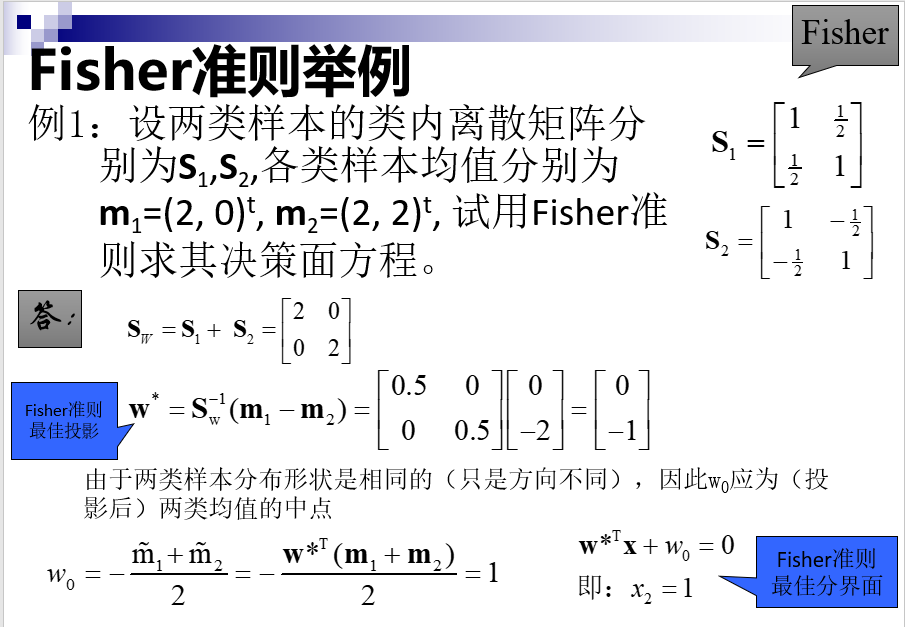

### 感知器准则

**规范化**

原本是
$$
\begin{cases}
w^Tx>0&x\in\omega_1\\
w^Tx<0&x\in\omega_2\\
\end{cases}
$$
定义
$$
x'=\begin{cases}
x&x\in\omega_1\\
-x&x\in\omega_2
\end{cases}
$$
于是
$$
\forall x',w^Tx'>0
$$
**感知器准测函数**
$$
J_p(w)=\sum_{x':w^Tx'<0}(-w^Tx')
$$
简而言之，分错的才算进来。显然我们要极小化这个函数。显然这个函数非负，最小为0。

**$w$迭代**

每次只看一个样本$x'$，如果分对($w^Tx'>0$)则不用更新，如果分错($w^Tx'\leq0$)则按如下公式更新
$$
w_{k+1}=w_k + rx'
$$
$r$是迭代的步长（学习率），一般取1.

**例子**

两个类原来的样子
$$
\omega_1=\{(0,0,1),(0,1,1)\}\\
\omega_2=\{(1,0,1),(1,1,1)\}
$$
规范化后
$$
\omega_1'=\{(0,0,1),(0,1,1)\}\\
\omega_2'=\{(-1,0,-1),(-1,-1,-1)\}
$$
我们初始化$w=(0,0,0)$

(0,0,0)×(0,0,1)=0，分错，更新为(0,0,0)+(0,0,1)=(0,0,1)

(0,0,1)×(0,1,1)=1，分对

(0,0,1)×(-1,0,-1)=-1，分错，更新为(0,0,1)+(-1,0,-1)=(-1,0,0)

(-1,0,0)×(-1,-1,-1)=1，分对

(-1,0,0)×(0,0,1)=0，分错，更新为(-1,0,0)+(0,0,1)=(-1,0,1)

(-1,0,1)×(0,1,1)=1，分对

(-1,0,1)×(-1,0,-1)=0，分错，更新为(-1,0,1)+(-1,0,-1)=(-2,0,0)

(-2,0,0)×(-1,-1,-1)=2，分对

(-2,0,0)×(0,0,1)=0，分错，更新为(-2,0,0)+(0,0,1)=(-2,0,1)

(-2,0,1)×(0,1,1)=1，分对

(-2,0,1)×(-1,0,-1)=1，分对

(-2,0,1)×(-1,-1,-1)=1，分对

至此所有样本分类正确，输出最终判别参数$w=(-2,0,1)$

**定理**

只要训练样本集线性可分，无论$w$初始值如何，感知器算法都能收敛。

### 最小均方误差准则

**最小均方误差准则函数**
$$
J_s(w)=||Xw-b||^2=\sum_{i=1}^m(x_i^Tw-b_i)^2=(Xw-b)^T(Xw-b)
$$
$X$是一个$m×n$矩阵，$m$是样本的数目，$n$是样本特征的数目，显然$X$的每一排对应一个样本。

$w$是$n$维列向量，$b$是$m$维列向量。

注意，此处的$X$中的样本也要像感知器准则那样作规范化。

**最优解**
$$
w^*=\arg\min_w J_s(w)=X^+b=(X^TX)^{-1}X^Tb
$$
$X^+$被叫做$X$的伪逆矩阵。

**例子**

此处的$Y$就是上面的$X$，并且考虑了bias。

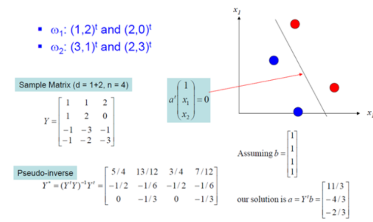

**迭代法求解**


## 优化

直接求解：拉格朗日乘子法

迭代求解：梯度下降法

## BP算法

### BP算法

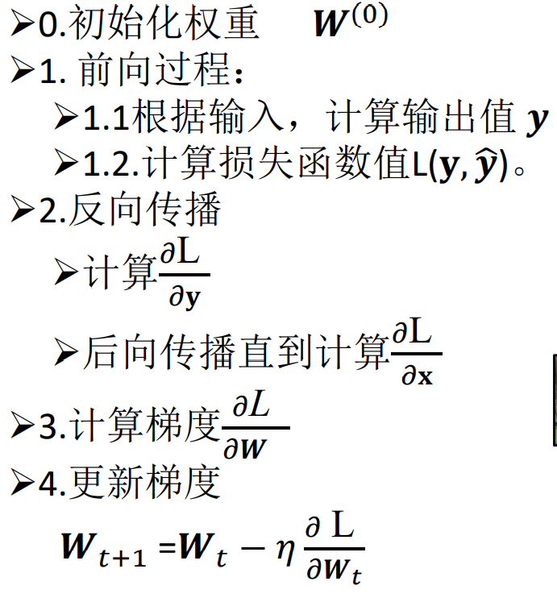

### BP公式实例

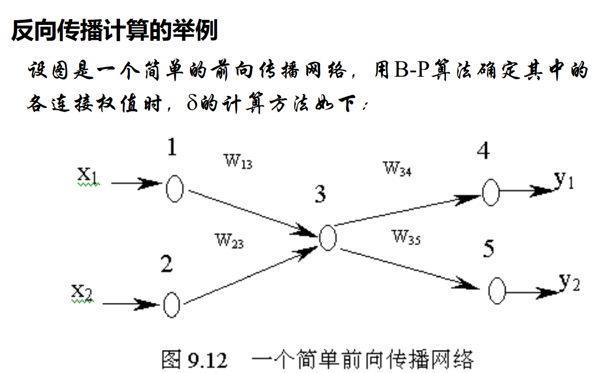

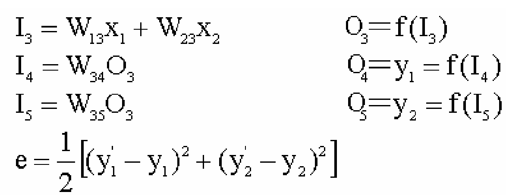

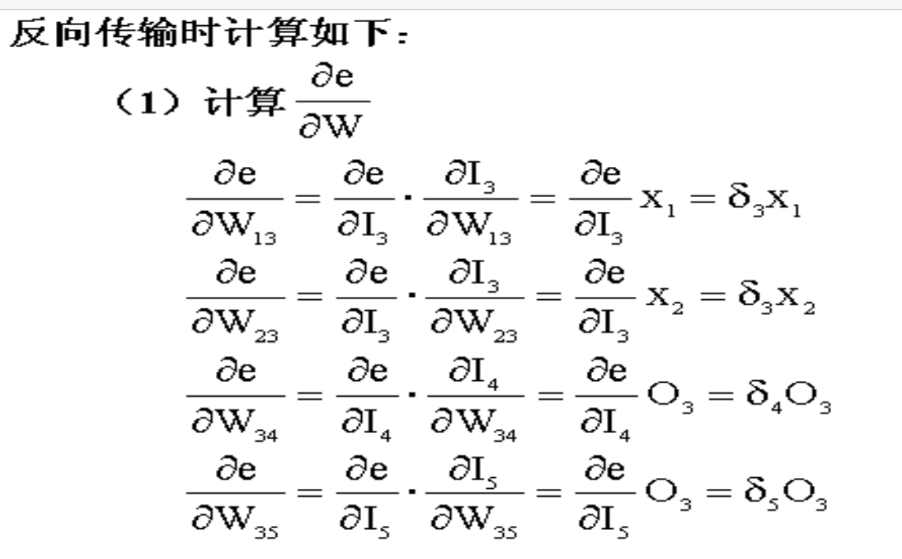

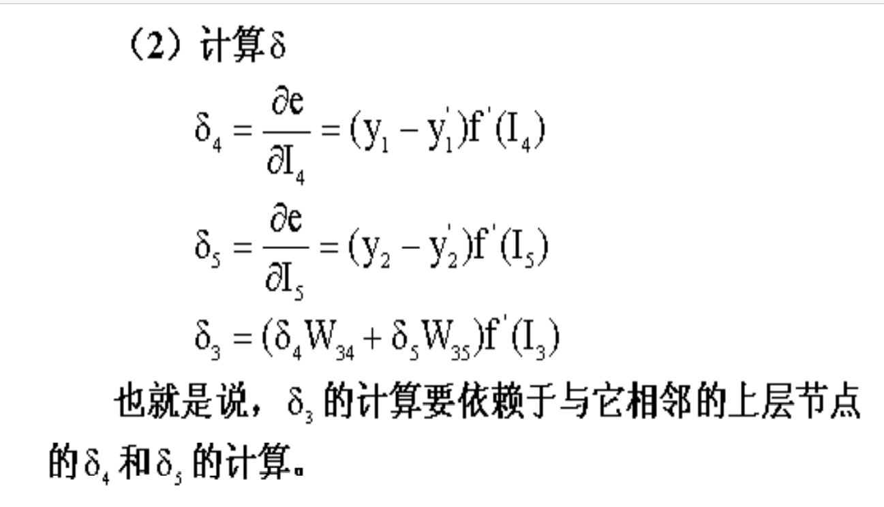

### BP数据实例

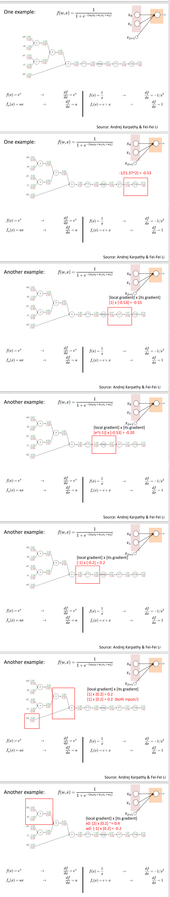

## 卷积神经网络

### 经典模型

LeNet，AlexNet，VGG，NiN，GoogleNet，ResNet，DenseNet。

### 输出图像尺寸

$$
\frac{N+2P-F}{S}+1
$$

其中N为输入图像尺寸，P为单侧padding数，F为卷积核尺寸，S为步幅。

### 参数个数计算

一层参数数目=输入通道×输出通道×卷积核的大小

例如输入3通道，输出2通道，卷积核是(3×3)，则此层参数个数为
$$
3×2×9=54
$$

### 池化层

池化层的参数个数为0！

**最大池化**

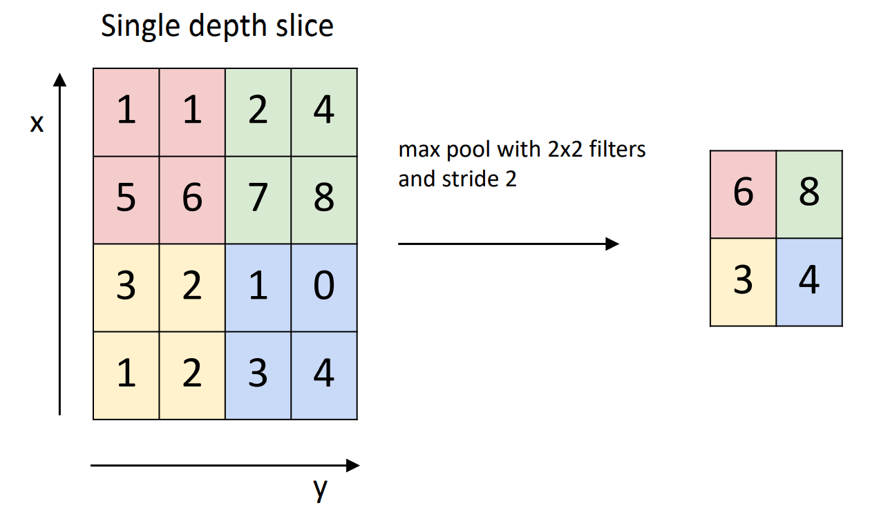

**平均池化**

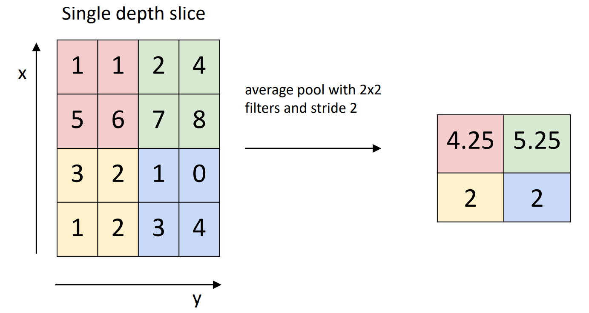

# 统计学习分类器

## 支持向量机

### 支持向量

各类中离决策面最近的样本点。

### 目标

极大化Margin，等价于极小化$||w||$.

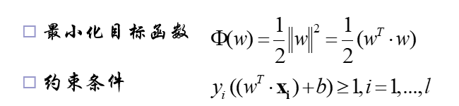

### 应用KKT

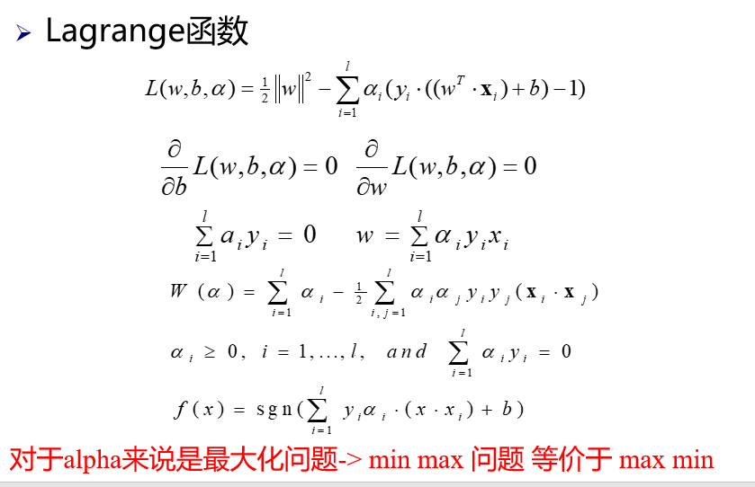

### 例子

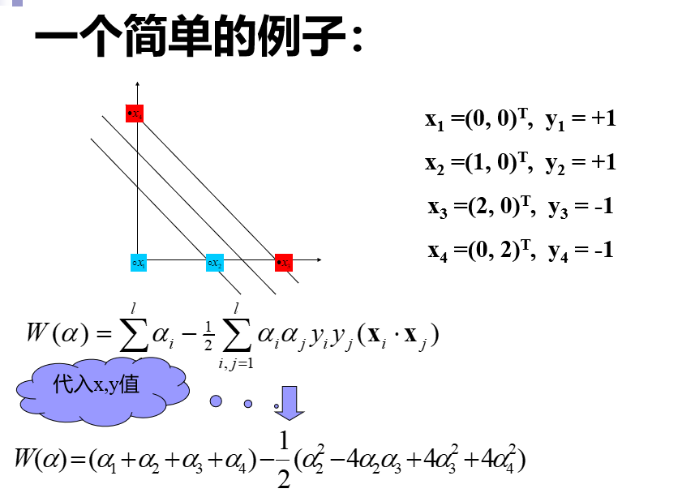


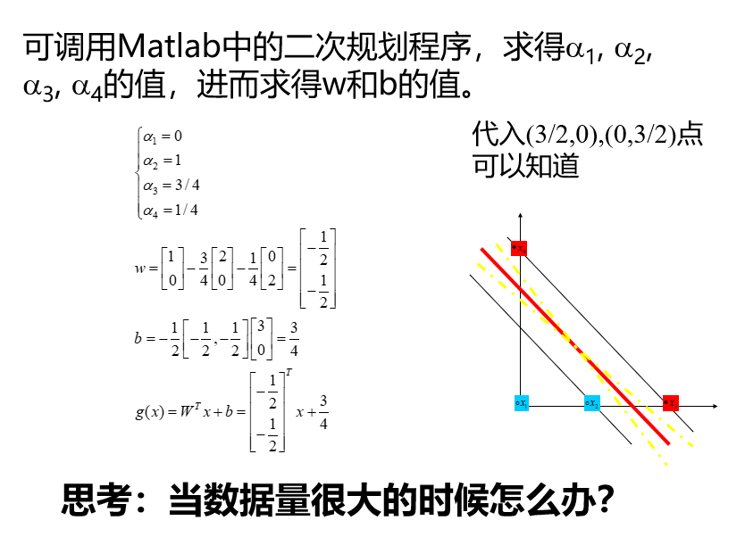

事实上求解这个$W(\alpha)$的时候仍然有约束在，并不是简单求个导就解出来的，还是得来KKT那套。意思就是，这个东西算起来是很复杂的，考试应该不会让算这个。实在要算的话，就列KKT的式子，然后把图画出来，结合着也能把答案猜出来应该。

### 软间隔

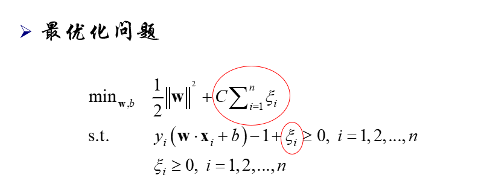

### Hibert-Schmidt原理

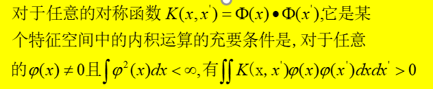

### 核函数

本质是重定义内积运算，以实现非线性的分类。

我们都知道，一个非线性的分类问题可以通过映射到更复杂的空间（不仅是增加维数、线性映射，还可以对空间进行扭曲），变成一个线性可分的问题。

然而空间变复杂后，计算复杂度也随之增加！

不过让我们来看看，在用SVM时，我们需要的究竟是什么？

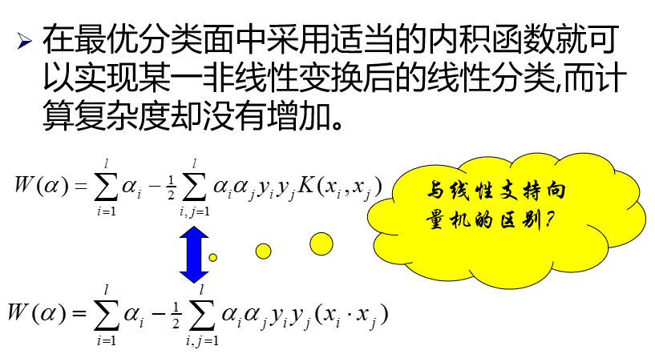

上图中，下面的式子是线性SVM中求解的优化目标，上方则是应用了核函数的SVM求解的优化目标。

没错！我们不需要整个复杂空间！我们需要的只是定义在这个空间上的内积！（All you need is Inner Product ！）

去到复杂空间里做计算很难，但若只需要这个空间里的内积，我们的计算量就不会增加多少。

当然，用于内积重定义的核函数当然要满足上面的Hibert-Schmidt原理。

SVM中常用核函数如下：


现在回顾一下，我们是如何在神经网络里引入非线性成分的呢？是激活函数！而此处我们往SVM中引入非线性时，所用的是核函数。

## 集成算法

### 分类

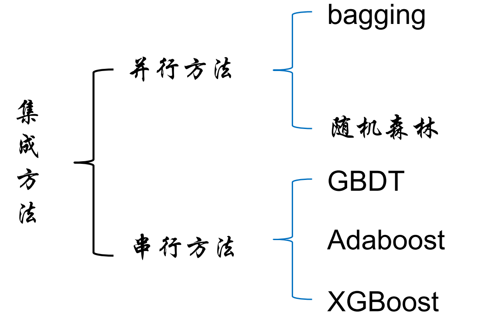

### Bagging

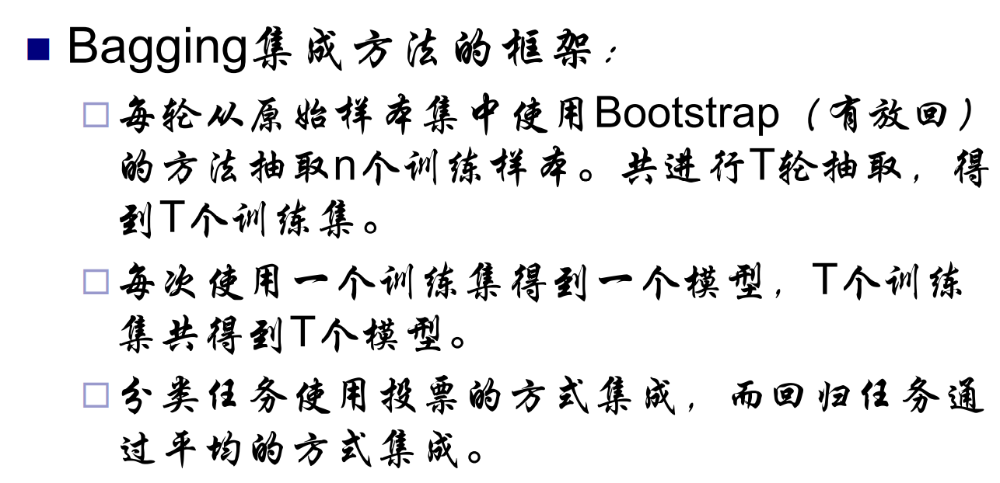

### Boosting

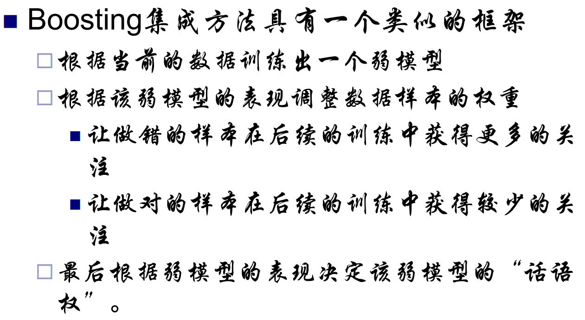

### Adaboost

考虑二分类问题，标签y为1或-1，每个弱分类器对一个样本的输出也是1或-1。
$$
\begin{aligned}
&初始化训练集D_1中样本的受关注度,每个样本的受关注度为1/m,m为训练集中样本数目\\
&\text{for}\space t=1,...,T:\qquad (假设我们要得到T个弱分类器)\\
&\qquad 新生成一个弱分类器h_t,在D_t上训练它,让它最小化加权误差e_t(即被错分样本的受关注度之和)\\
&\qquad 分类器h_t的话语权\alpha_t=\frac{1}{2}\ln\frac{1-e_t}{e_t}\\
&\qquad Z_t=\sum_{i=1}^m D_{t}(i)\exp(-\alpha_ty_ih_t(x_i))\qquad D_t(i)表示第i个样本在数据集D_t中的受关注度\\ 
&\qquad \text{for}\space i=1,...,m:\\
&\qquad\qquad D_{t+1}(i)=\frac{D_t(i)}{Z_t}\exp(-\alpha_ty_ih_t(x_i))\qquad(Z_t的意义在于使得样所有本受关注度之和保持为1)\\
&输出集成分类器 H(x)=\text{sgn}(\sum_{i=1}^T\alpha_th_t(x))
\end{aligned}
$$
例子：https://zhuanlan.zhihu.com/p/27126737

### 随机森林

**随机树**

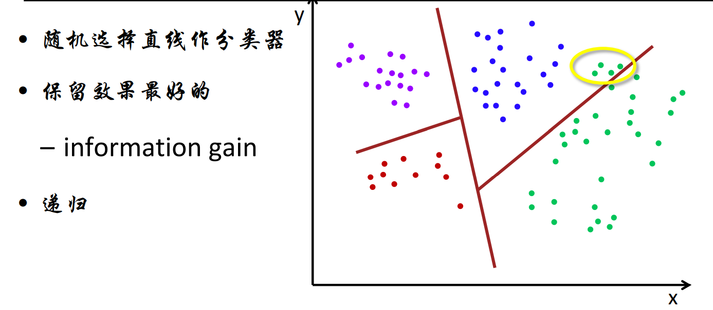

**随机森林**

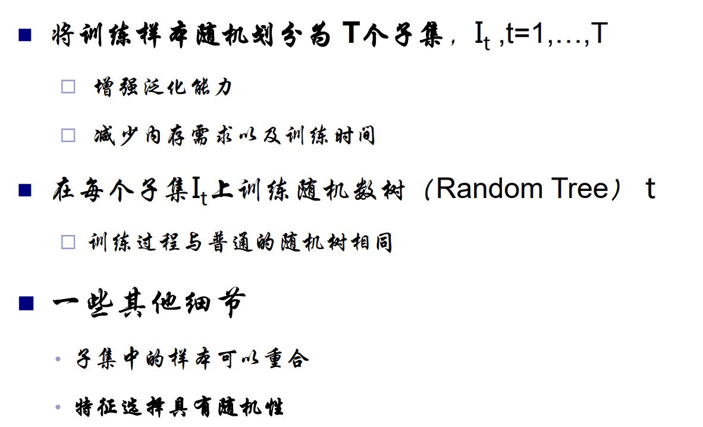

**PPT上的图示**

我们得到了若干随机树，展示其中的6棵：

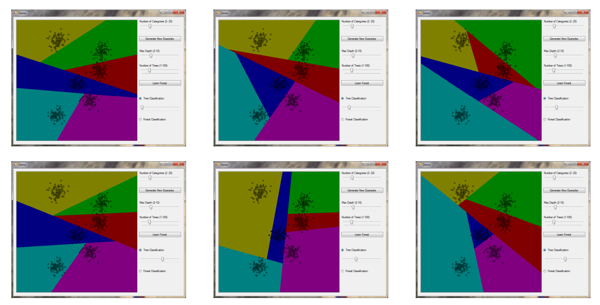

然后我们把所有随机树集成在一起（即对于界面中的每个点，所有树投票决定这个点属于哪类），得到最终结果：

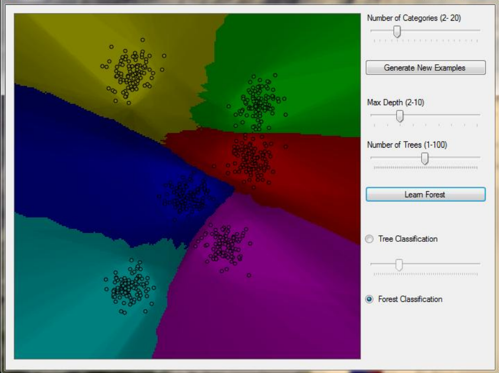

例子：https://blog.csdn.net/yangyin007/article/details/82385967

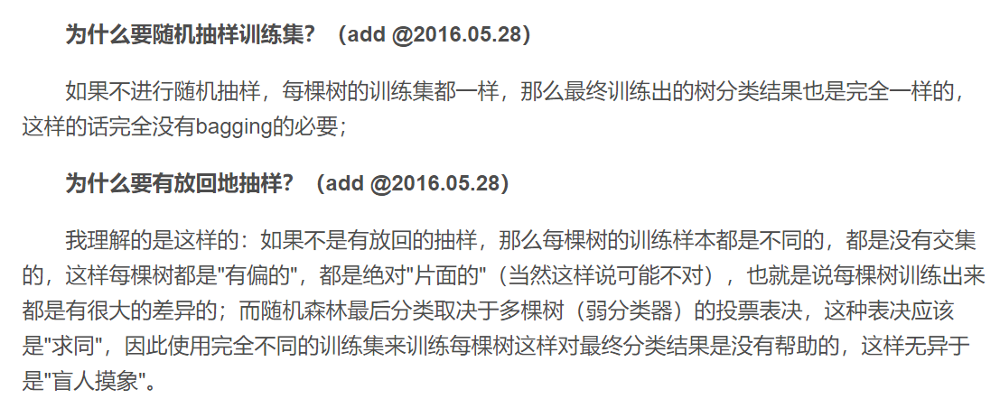

## 子空间学习

### 主成分分析（PCA）

1.计算均值样本，并把每个样本减去均值样本得到新的数据集

2.计算新的数据集上的协方差矩阵

3.计算协方差矩阵的特征值

4.将特征值从大到小排序，按要求选取最大的几个，算出其对应特征向量

**例**

三个样本(1,1),(2,2),(3,3)要降到一维。

1.求均值样本
$$
\frac{(1,1)+(2,2)+(3,3)}{3}=(2,2)
$$
每个样本都减去均值样本得
$$
(-1,-1),(0,0),(1,1)
$$
2.计算协方差矩阵（因为数据是2维的所以是2×2的，第一维叫x，第二维叫y）。
$$
A=\left(\begin{matrix}Cov(x,x)&Cov(x,y)\\Cov(y,x)&Cov(y,y)\end{matrix}\right)
$$
其中协方差的计算公式为
$$
Cov(x,y)=E(xy)-E(x)E(y)
$$
E是期望。显然可以计算得到
$$
E(x)=E(y)=0,E(x^2)=E(y^2)=E(xy)=\frac{2}{3}
$$
所以协方差矩阵
$$
A=\left(\begin{matrix}\frac{2}{3}&\frac{2}{3}\\\frac{2}{3}&\frac{2}{3}\end{matrix}\right)
$$
解：
$$
|A-\lambda I|=\left|\begin{matrix}\frac{2}{3}-\lambda&\frac{2}{3}\\\frac{2}{3}&\frac{2}{3}-\lambda\end{matrix}\right|=0
$$
得特征值（从大到小排序）
$$
\lambda_1=\frac{4}{3},\lambda_2=0
$$
求$\lambda_1$对应的特征向量：
$$
A\left(\begin{matrix}x\\y\end{matrix}\right)=\lambda_1 \left(\begin{matrix}x\\y\end{matrix}\right)
$$
得单位化特征向量$(\frac{1}{\sqrt{2}},\frac{1}{\sqrt{2}})^T$

所以我们用于的线性映射就是（这里看来只保留了一个乘积项，因为我们只保留了一个主成分；若保留多个主成分，就把每个所选特征值对应的映射加在一起就是总映射了）
$$
(\frac{1}{\sqrt{2}},\frac{1}{\sqrt{2}})\left(\begin{matrix}x\\y\end{matrix}\right)
$$
原来的二维的(1,1),(2,2),(3,3)就分别映射到一维的
$$
(\sqrt{2}),(2\sqrt{2}),(3\sqrt{2})
$$
**累积贡献率**

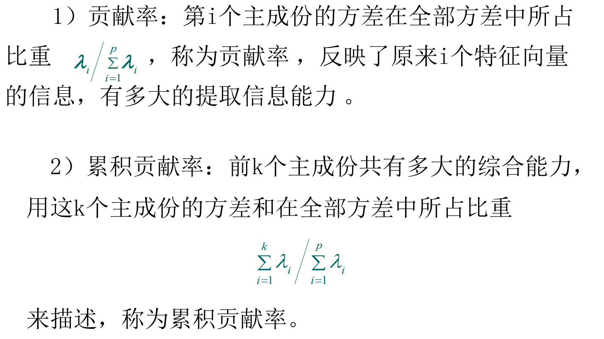

比如我们上面的例子中，第一个主成分的贡献率就达到了100%。显然，这是因为三个点都在一条直线上。

下面有一个计算累积贡献率的例子。

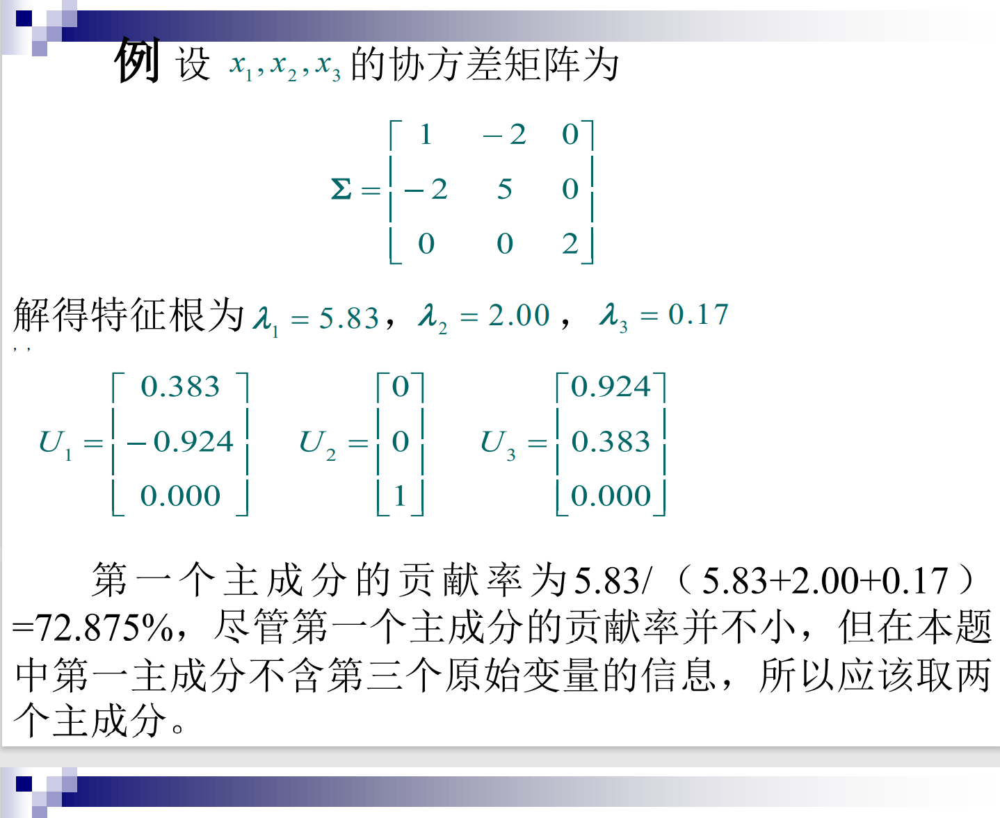

emm，下面这段分析还搞挺复杂的。我的建议是，按照累积贡献率达到95%得选就行了。

### Fisher判别分析（LDA）

与主成分分析相比，计算的不再是协方差矩阵的特征值、特征向量，而是下面这个矩阵的特征值、特征向量：
$$
S_w^{-1}S_b
$$
然后选最大的几个特征值啦，计算对应的特征向量啦，得到最终的线性映射啦都是和PCA一样的。

$S_w$和$S_b$与线性判别准则那儿的Fisher准则一样。

### 核判别分析（kernel PCA）

也跟上面两个流程差不多，不过解的矩阵不是协方差矩阵，而是用前面的核函数去构造出一个核矩阵。

太复杂了，不想看了。

## 稀疏表示

### 原理

对于一个分类问题（如人脸分类），当系统收到一张新的人脸时，系统会尝试用库里已有的人脸图片加权求和来逼近这张新的人脸。在这个过程中，库里与新人脸是同一个人的那些人脸图片的权重就会明显大于不是同一个人的那些人脸图片（也就是大多权重都接近于0，只有少数图片权重比较大），我们就可以根据这个权重来判断这张新的人脸是谁。

### 稀疏表示分类（SRC）

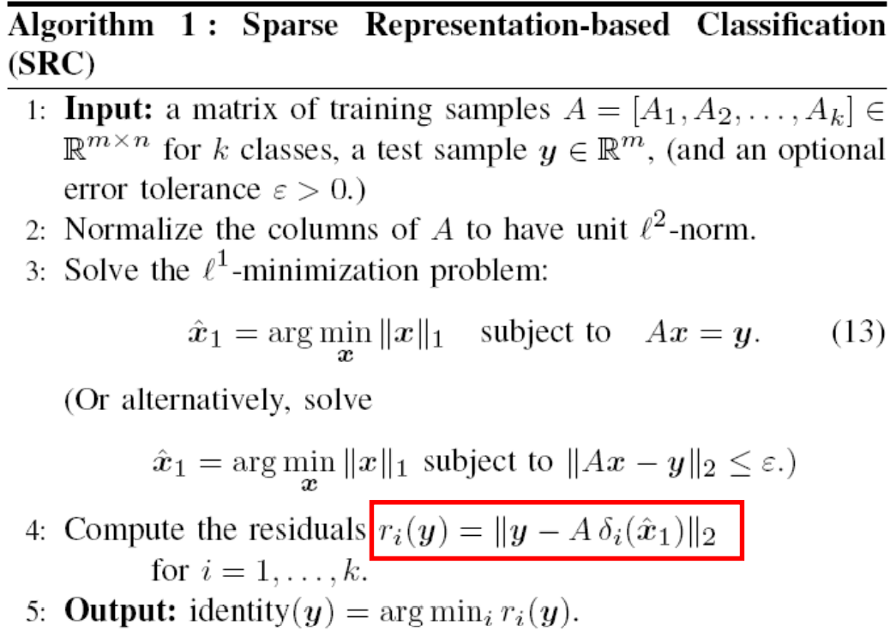

红色部分即下面这个意思：
$$
r_i(y)=||y-A_i(\hat{x_1})_i||_2
$$
$A_i$是第$i$类的所有训练样本，$(\hat{x_1})_i$是$\hat{x_1}$中与$A_i$中的样本相对应的分量。

什么意思呢，就是说，前面算$\hat{x_1}$的时候是直接用了整个训练集里面的所有样本的——计算所得的向量$\hat{x_1}$，它的第i个分量，即代表着训练集中第i个样本的权重。但是我们现在要判断这个测试样本到底是哪类的，于是我们现在对于训练集中的每个类别，我们只拿属于这个类别的样本及其在$\hat{x_1}$中的权重来计算，并与y作差——最后当然选差最小的那一类作为结果啦！

简而言之，拿到一个新样本后，每一类的训练样本都参与到构建这个新样本的行动中来，得到每个样本的权重；然后又让每一类的样本拿着已经被分配好的权重单干，看哪类计算结果跟y最接近，就选哪类作为结果。

# 以上出现过计算的地方

1.极大极小算法

2.α-β剪枝

3.蒙特卡洛树

4.Q学习

5.朴素贝叶斯分类器

6.Viterbi算法

7.信息增益

8.广义线性判别函数

9.Fisher准则

10.感知器准则

11.最小均方误差准则

12.BP算法公式实例

13.BP算法数据实例

14.输出图像尺寸

15.参数个数计算

16.池化层

17.主成分分析
